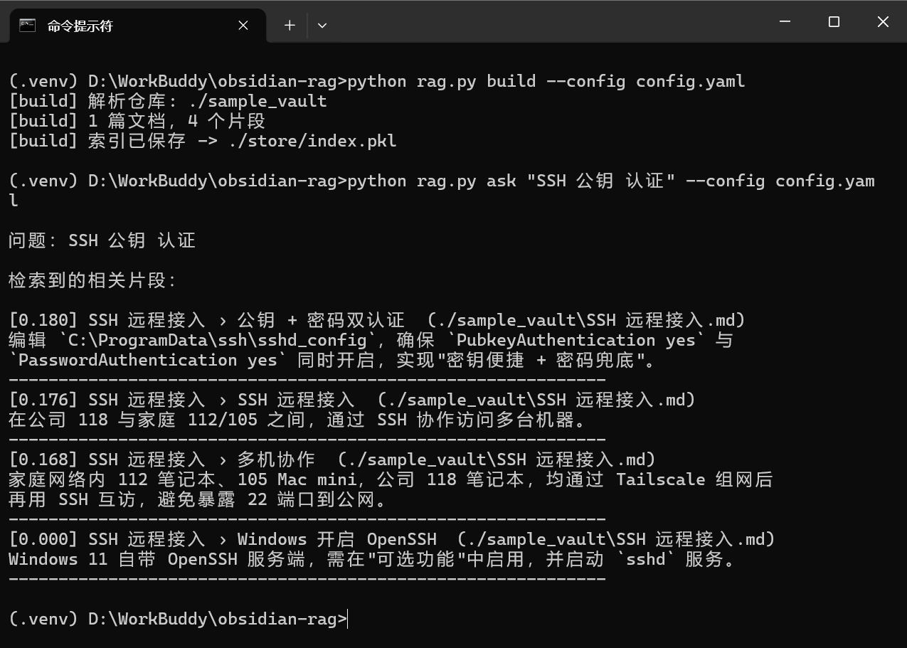
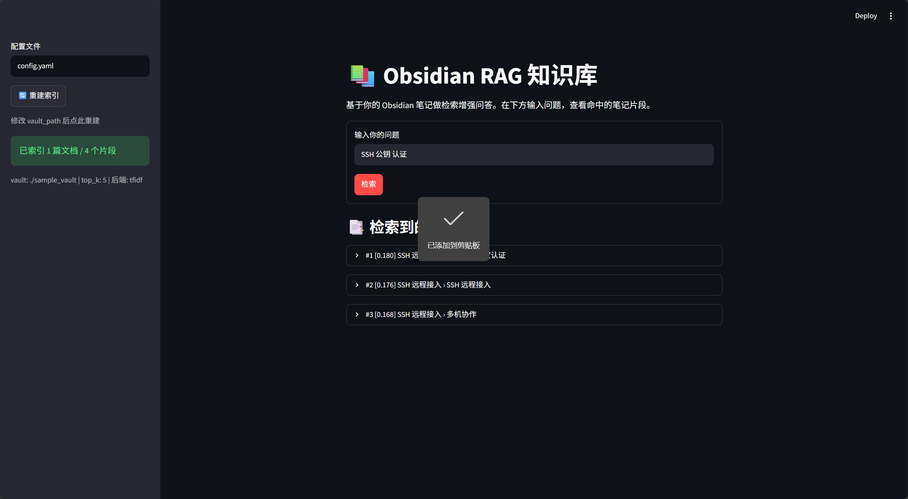
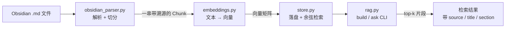

# Obsidian RAG 知识库

[](https://www.python.org/)
[](LICENSE)
[](requirements.txt)
[](https://github.com/zhengjia626/obsidian-rag/pulls)

把你的 Obsidian 笔记变成一个**可问答的本地知识库**。零 API Key 即可跑通（默认 TF-IDF 基线），
后续可一键升级为语义向量 + LLM 生成。这是一个**教学 / 作品集骨架**：结构清晰、易扩展、clone 即运行。

> 适合作为「能跑、能讲清设计取舍」的公开项目——尤其适合刚入门 AI / 想积累 GitHub 作品集的同学。

## 演示



对示例笔记提问 `python rag.py ask "SSH 公钥 认证" --config config.yaml`，
返回按相似度排序、带 `标题 › 章节 › 来源路径` 溯源信息的 top-k 片段。

## Web界面



```bash
pip install streamlit
streamlit run app.py
```

## 特性

- **解析 Obsidian Markdown**：自动剥离 frontmatter、保留 `[[wikilink|显示文本]]` 的显示文本
- **分段 + 滑动窗口切分**：按 Markdown 标题分段，超长段再按重叠窗口切块，并保留**来源与章节**溯源信息
- **嵌入后端可插拔**：`tfidf`（默认，零依赖）/ `sentence-transformers` / `openai`，改配置一行切换，业务代码零改动
- **可选 LLM 综合生成**：设 `llm.enabled: true` 即可把检索到的片段综合成自然语言答案
- **含示例笔记库与演示脚本**：`git clone` 下来即可运行，无需自备数据

## 架构 / 数据流程



设计理念：**解析层是整条链路的「进水口」**。它的脏数据（未剥离的 frontmatter、未清洗的 `[[` 符号）
会一路污染到检索质量，所以这一层的目标不是「能跑就行」，而是「切得干净、溯源完整」。

## 项目结构

```
obsidian-rag/
├── rag.py                 # CLI 入口（build / ask 两个子命令）
├── obsidian_parser.py     # Obsidian Markdown 解析与切分（去 frontmatter、清 wikilink、分段切块）
├── embeddings.py          # 嵌入后端（TF-IDF / sentence-transformers / openai），可插拔
├── store.py               # 极简持久化向量库（numpy + pickle，余弦检索）
├── demo_store.py          # 存储层检索演示脚本（验证用，含中文查询）
├── config.example.yaml    # 配置模板（复制为 config.yaml 使用）
├── requirements.txt       # 仅 numpy + pyyaml 即可跑通 TF-IDF 基线
├── .gitignore             # 已忽略 .venv/ config.yaml store/ *.pkl
├── sample_vault/          # 示例笔记库（当前 1 篇，可直接替换为你的 vault）
│   └── SSH 远程接入.md
└── store/                 # 构建产物（由 build 生成，已 gitignore，不入库）
    └── index.pkl
```

## 快速开始

```bash
# 1. 安装依赖（零依赖即可跑通 TF-IDF 基线）
pip install -r requirements.txt

# 2. 准备配置
cp config.example.yaml config.yaml
#   把 vault_path 改成你自己的 Obsidian 仓库路径（示例用的是 ./sample_vault）

# 3. 构建索引
python rag.py build --config config.yaml

# 4. 提问（默认返回检索到的相关片段）
python rag.py ask "SSH 公钥 认证" --config config.yaml
```

### ⚠️ Windows 用户必看（环境坑）

本项目在 Windows 11 上实测踩过以下坑，提前规避：

1. **确认 Python 是真实版本**：新装 Python 后先跑 `python --version`。若弹出 Microsoft Store，
   说明 PATH 里是「商店占位桩」而不是真 Python——去 python.org 装一个并勾选 *Add Python to PATH*，
   或在「管理应用执行别名」里关掉 `python.exe` / `python3.exe` 两个开关。
2. **用 `python -m pip` 而不是裸 `pip`**：`pip install ...` 常因 PATH 找不到而报错，
   `python -m pip install ...` 让解释器调自带模块，最稳。
3. **激活虚拟环境**：CMD 用 `.venv\Scripts\activate.bat`；PowerShell 用 `Activate.ps1`。
   激活后提示符前会出现 `(.venv)`。
4. **别把中文塞进 `python -c "..."`**：PowerShell / CMD 传参会把中文和内部双引号搞乱，造成「假成功真失败」
   （exit code 0 但实际报 SyntaxError）。需要跑带中文的逻辑时，写成 `.py` 脚本再 `python xxx.py`
   —— 本项目 `demo_store.py` 就是这么做的。

## 配置说明

`config.yaml`（由 `config.example.yaml` 复制而来）字段含义：

| 字段 | 默认值 | 说明 |
|---|---|---|
| `vault_path` | `./sample_vault` | Obsidian 仓库根目录，改成你自己的笔记库路径 |
| `store_path` | `./store/index.pkl` | 构建出的向量索引保存位置（已 gitignore） |
| `chunk_size` | `500` | 单片段最大字符数，超过则滑动窗口切块 |
| `chunk_overlap` | `80` | 相邻片段重叠字符数，防止切断语义 |
| `top_k` | `5` | 检索返回的片段条数 |
| `embedding.backend` | `tfidf` | 嵌入后端：`tfidf` / `sentence-transformers` / `openai` |
| `embedding.model` | `null` | 语义后端时的模型名（如 `all-MiniLM-L6-v2`） |
| `embedding.base_url` | `null` | openai 兼容网关地址（可选） |
| `llm.enabled` | `false` | 是否启用 LLM 综合生成答案 |
| `llm.base_url` | `https://api.openai.com/v1` | LLM 接口地址 |
| `llm.model` | `gpt-4o-mini` | 生成用的模型 |
| `llm.api_key_env` | `OPENAI_API_KEY` | 从环境变量读取密钥（**勿硬编码**） |

## 演示脚本：demo_store.py

```bash
python demo_store.py
```

直接演示存储层的余弦检索（对示例笔记做中文查询，打印 top-3 相关片段及其章节）。
它把中文逻辑写在 `.py` 文件里而非 `python -c` 参数，绕开上面的编码坑，是「验证存储层」最省事的方式。

## 升级为语义检索（可选）

编辑 `config.yaml`：

```yaml
embedding:
  backend: "sentence-transformers"
  model: "all-MiniLM-L6-v2"   # 首次运行会下载模型
```

然后 `pip install sentence-transformers`，重新 `python rag.py build` 即可获得**语义级**召回
（相近含义的文本即使用词不同也能命中，分数也远比 TF-IDF 在小语料下合理）。

## 升级为 LLM 问答（可选）

```yaml
llm:
  enabled: true
  base_url: "https://api.openai.com/v1"
  model: "gpt-4o-mini"
  api_key_env: "OPENAI_API_KEY"   # 从环境变量读取密钥，勿硬编码
```

设置环境变量 `set OPENAI_API_KEY=sk-...`（Windows CMD）后重新 `ask`，即可返回综合答案而非原始片段。

## 设计决策（为什么这样写）

这些取舍是本项目作为「教学 / 作品集」的核心价值，也是面试中被追问的高频点：

- **默认 TF-IDF 零依赖基线**：不下载模型、不调 API，clone 即跑——代价是语义弱，但作为教学基线足够清晰。
- **嵌入后端用「抽象基类 + 工厂函数」实现可插拔**：`EmbeddingBackend` 抽象类 + `build_backend(name)` 工厂，
  新增后端只需写一个子类、在工厂加一行，**业务代码（`rag.py`）完全不用改**。
- **懒加载大依赖**：`sentence-transformers` / `openai` 的 import 写在函数/类内部，
  不装这些库模块照样能 import、TF-IDF 照样能跑——避免「装不起大库就用不了整个项目」。
- **存储层用 numpy + pickle 而非 Chroma/FAISS**：刻意把余弦检索逻辑讲透（一次矩阵运算算完所有相似度），
  逻辑透明、易懂；需要生产级能力时再替换，README 已标明这是可升级点。
- **溯源字段（source / title / section）**：每个片段都记得「出自哪篇、哪节」，召回后可直接回跳原笔记，
  没有溯源信息的片段对问答毫无价值。

## 下一步可扩展

- [ ] 补充 `tests/` 单元测试（切分、嵌入维度一致性、检索排序）
- [x] 提供 Web UI（已实现 `app.py`，Streamlit 一行起服务，做成可在线演示）
- [ ] 增量更新索引（只重建变更的笔记，而非每次全量）
- [ ] 接入 Chroma / FAISS 等更专业的向量库
- [ ] 把检索结果做成可点击的 Obsidian 链接回跳
- [ ] 连上你真实的笔记库 + 补 2 个端到端项目，作为公开作品集发布

> 提示：这是骨架项目，重点在于「能跑、能讲清设计取舍」。把它连上你真实的 Obsidian 仓库，
> 再补一个 Web 演示，就是一份很有说服力的公开 GitHub 作品集。

## 许可证

本项目采用 [MIT License](LICENSE) 开源。
